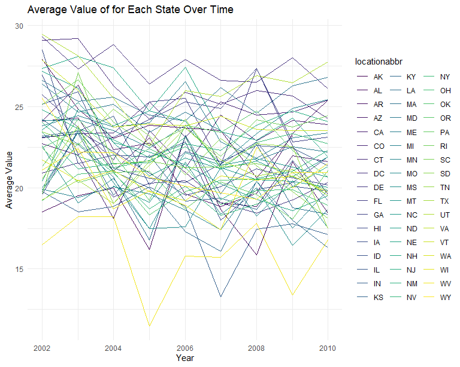
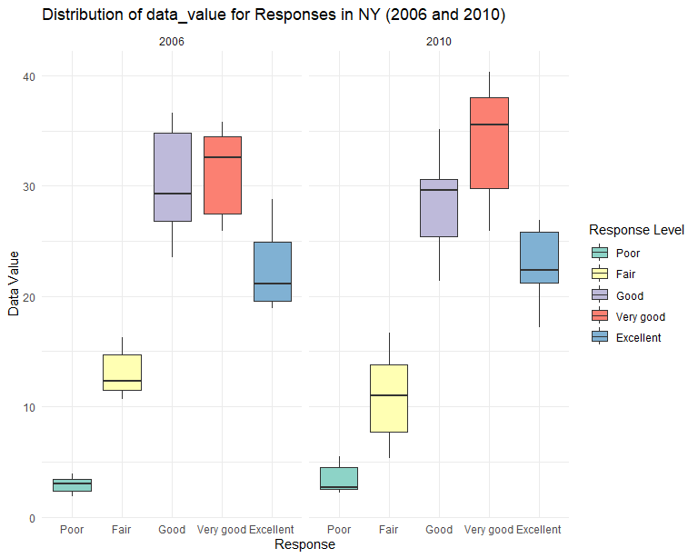
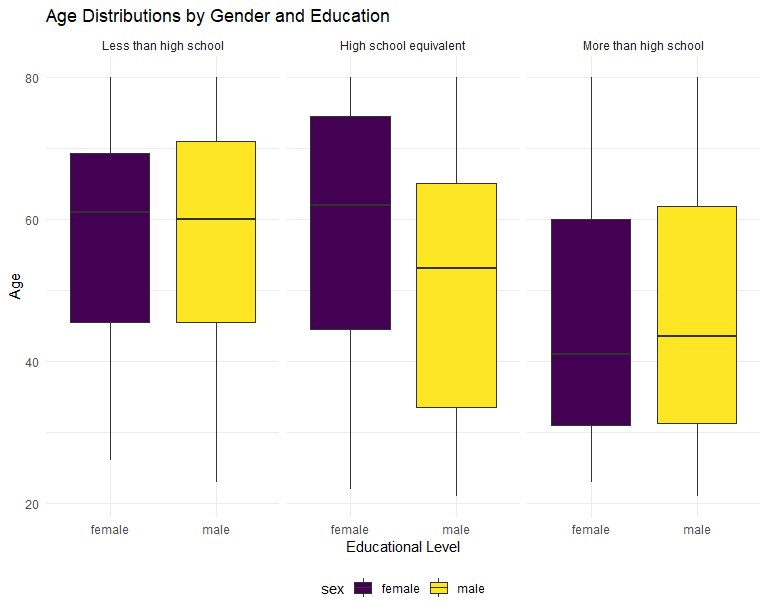
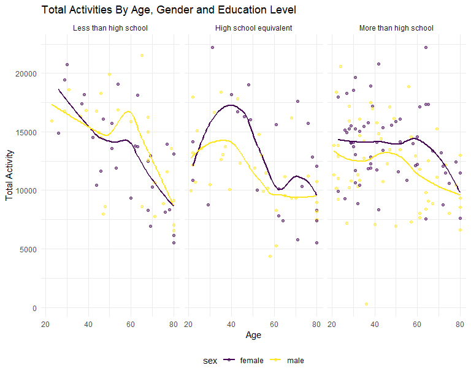
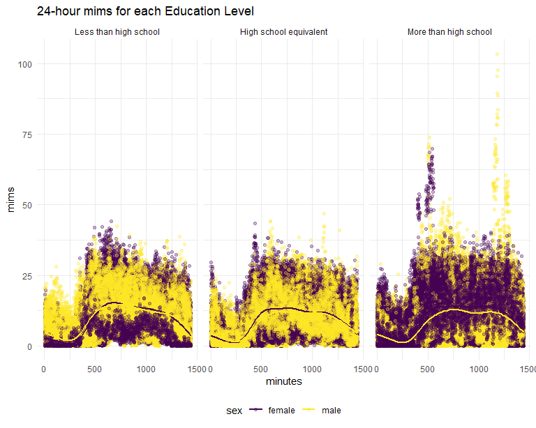

p8105_hw3_td2809
================
Chris Deng
2023-10-14

# Problem 1

``` r
data("instacart") # import dataset

instacart = 
  instacart |> 
  as_tibble()
```

The data set `instacart` contains 1384617 observations and 15 variables
related to the information of 131209 orders of 131209 users.

- How many aisles are there, and which aisles are the most items ordered
  from?

``` r
aisles_number = 
  instacart |> 
  group_by(aisle) |> 
  summarize(count_aisle = n()) |> 
  mutate(rank_aisle = min_rank(desc(count_aisle))) |> 
  arrange(rank_aisle)
```

There are 134 aisles and fresh vegetables is the aisle with the most
items ordered from.

- Make a plot that shows the number of items ordered in each aisle,
  limiting this to aisles with more than 10000 items ordered. Arrange
  aisles sensibly, and organize your plot so others can read it.

``` r
instacart |> 
  group_by(aisle)|>
  summarize(count_aisle = n())|>
  arrange(count_aisle)|>
  filter(count_aisle > 10000) |> 
  ggplot(aes(x = reorder(aisle, count_aisle), y = count_aisle)) +
  geom_bar(stat = "identity", alpha = .75) + 
  labs(title = "Number of Items Ordered in Each Aisle") +
  theme(
    axis.text.x = element_text(angle = 45, hjust = 1) 
    )
```


- Make a table showing the three most popular items in each of the
  aisles “baking ingredients”, “dog food care”, and “packaged vegetables
  fruits”. Include the number of times each item is ordered in your
  table.

``` r
instacart |> 
  filter(aisle %in% c("baking ingredients", "dog food care", "packaged vegetables fruits")) |> 
  count(aisle, product_name, sort = T) |> 
  group_by(aisle) |> 
  top_n(3, n) |> # top 3 products within each group
  knitr::kable()
```

| aisle                      | product_name                                  |    n |
|:---------------------------|:----------------------------------------------|-----:|
| packaged vegetables fruits | Organic Baby Spinach                          | 9784 |
| packaged vegetables fruits | Organic Raspberries                           | 5546 |
| packaged vegetables fruits | Organic Blueberries                           | 4966 |
| baking ingredients         | Light Brown Sugar                             |  499 |
| baking ingredients         | Pure Baking Soda                              |  387 |
| baking ingredients         | Cane Sugar                                    |  336 |
| dog food care              | Snack Sticks Chicken & Rice Recipe Dog Treats |   30 |
| dog food care              | Organix Chicken & Brown Rice Recipe           |   28 |
| dog food care              | Small Dog Biscuits                            |   26 |

- Make a table showing the mean hour of the day at which Pink Lady
  Apples and Coffee Ice Cream are ordered on each day of the week;
  format this table for human readers (i.e. produce a 2 x 7 table).

``` r
instacart |> 
  filter(product_name %in% c("Pink Lady Apples", "Coffee Ice Cream")) |> 
  group_by(product_name,order_dow) |> 
  summarise(mean_hour = mean(order_hour_of_day)) |> 
  pivot_wider(
    names_from = order_dow,
    values_from = mean_hour
  ) |> 
  knitr::kable(digits = 2)
```

    ## `summarise()` has grouped output by 'product_name'. You can override using the
    ## `.groups` argument.

| product_name     |     0 |     1 |     2 |     3 |     4 |     5 |     6 |
|:-----------------|------:|------:|------:|------:|------:|------:|------:|
| Coffee Ice Cream | 13.77 | 14.32 | 15.38 | 15.32 | 15.22 | 12.26 | 13.83 |
| Pink Lady Apples | 13.44 | 11.36 | 11.70 | 14.25 | 11.55 | 12.78 | 11.94 |

# Problem 2

First, do some data cleaning:

``` r
data("brfss_smart2010")
cleaned_brfss = brfss_smart2010 |>
  janitor::clean_names() |>
  filter(
    topic == "Overall Health", 
    response %in% c("Excellent", "Very good", "Good", "Fair", "Poor")
    ) |>
  mutate(
    response = factor(response, levels = c("Poor", "Fair", "Good", "Very good", "Excellent"))
  )
```

``` r
states_observed = cleaned_brfss |>
  group_by(year, locationabbr) |>
  summarise(locations_count = n_distinct(locationdesc), .groups = "drop") |>
  filter(locations_count >= 7)|>
  arrange(desc(locations_count))
#In 2002
states_2002 = filter(states_observed, year == 2002) 
 knitr::kable(states_2002, 
      title = "States that observed at 7 or more locations in 2002", 
      col.names = c("Year", "State", "Locations Count"))
```

| Year | State | Locations Count |
|-----:|:------|----------------:|
| 2002 | PA    |              10 |
| 2002 | MA    |               8 |
| 2002 | NJ    |               8 |
| 2002 | CT    |               7 |
| 2002 | FL    |               7 |
| 2002 | NC    |               7 |

``` r
#in 2010
states_2010 = filter(states_observed, year == 2010)
 knitr::kable(states_2010, 
      title = "States that observed at 7 or more locations in 2010", 
      col.names = c("Year", "State", "Locations Count"))
```

| Year | State | Locations Count |
|-----:|:------|----------------:|
| 2010 | FL    |              41 |
| 2010 | NJ    |              19 |
| 2010 | TX    |              16 |
| 2010 | CA    |              12 |
| 2010 | MD    |              12 |
| 2010 | NC    |              12 |
| 2010 | NE    |              10 |
| 2010 | WA    |              10 |
| 2010 | MA    |               9 |
| 2010 | NY    |               9 |
| 2010 | OH    |               8 |
| 2010 | CO    |               7 |
| 2010 | PA    |               7 |
| 2010 | SC    |               7 |

- In 2002, PA, MA, NJ, CT, FL, NC were observed at 7 or more locations.
  In 2010, FL, NJ, TX, CA, MD, NC, NE, WA, MA, NY, OH, CO, PA, SC were
  observed at 7 or more locations.

Then, we construct a data set that is limited to `Excellent` responses,
and contains, year, state, and a variable `mean_value` that averages the
`data_value` across locations within a state.

``` r
excellent_responses = cleaned_brfss |>
  filter(response == "Excellent") |>
  group_by(year, locationabbr) |>
  summarise(average_value = mean(data_value, na.rm = T))
```

    ## `summarise()` has grouped output by 'year'. You can override using the
    ## `.groups` argument.

Make a “spaghetti” plot of this average value over time within a state.

``` r
ggplot(excellent_responses, aes(x = year, y = average_value, group = locationabbr, color = locationabbr)) +
  geom_line() +
  labs(title = "Average Value of for Each State Over Time", x = "Year", y = "Average Value") +
  theme_minimal()
```


Make a two-panel plot showing, for the years 2006, and 2010,
distribution of `data_value` for responses (“Poor” to “Excellent”) among
locations in NY State.

``` r
ny_data = cleaned_brfss |>
  filter(locationabbr == "NY", year %in% c(2006, 2010))
ggplot(ny_data, aes(x = response, y = data_value, fill = response)) +
  geom_boxplot() + 
  facet_wrap(~year, scales = "free_x") + 
  scale_fill_brewer(palette = "Set3", name = "Response Level") +
  labs(
    title = "Distribution of data_value for Responses in NY (2006 and 2010)",
    x = "Response",
    y = "Data Value"
  ) +
  theme_minimal() +
  theme(legend.position = "right")
```


The distributions of responses are similar for 2006 and 2010, with the
value increasing from “Poor” to “Very good” and decreasing from “Very
good” to “Excellent”. Overall, the values within the same response
increase from 2006 to 2010.

# Problem 3

Load, tidy, merge, and otherwise organize the data sets.

``` r
demographic =
  read_csv("data/nhanes_covar.csv", skip = 4) |> 
  janitor::clean_names() |> 
  drop_na() |> 
  filter(age > 20) |>
  mutate(
    sex = factor(recode(sex, "1" = "male", "2" = "female")),
    education = recode(education, `1` = "Less than high school",`2` =  "High school equivalent",`3`  = "More than high school"),education = factor(education, levels = c("Less than high school", "High school equivalent", "More than high school")))
```

    ## Rows: 250 Columns: 5
    ## ── Column specification ────────────────────────────────────────────────────────
    ## Delimiter: ","
    ## dbl (5): SEQN, sex, age, BMI, education
    ## 
    ## ℹ Use `spec()` to retrieve the full column specification for this data.
    ## ℹ Specify the column types or set `show_col_types = FALSE` to quiet this message.

``` r
accelerometer = 
  read_csv("data/nhanes_accel.csv") |> 
  janitor::clean_names() |> 
  pivot_longer(
    min1:min1440,
    names_to = "minute",
    values_to = "mims",
    names_prefix = "min"
  ) |> 
  mutate(
    minute = as.numeric(minute)
  )
```

    ## Rows: 250 Columns: 1441
    ## ── Column specification ────────────────────────────────────────────────────────
    ## Delimiter: ","
    ## dbl (1441): SEQN, min1, min2, min3, min4, min5, min6, min7, min8, min9, min1...
    ## 
    ## ℹ Use `spec()` to retrieve the full column specification for this data.
    ## ℹ Specify the column types or set `show_col_types = FALSE` to quiet this message.

``` r
mims = 
  demographic |> 
  left_join(accelerometer)
```

    ## Joining with `by = join_by(seqn)`

``` r
str(mims)
```

    ## tibble [328,320 × 7] (S3: tbl_df/tbl/data.frame)
    ##  $ seqn     : num [1:328320] 62161 62161 62161 62161 62161 ...
    ##  $ sex      : Factor w/ 2 levels "female","male": 2 2 2 2 2 2 2 2 2 2 ...
    ##  $ age      : num [1:328320] 22 22 22 22 22 22 22 22 22 22 ...
    ##  $ bmi      : num [1:328320] 23.3 23.3 23.3 23.3 23.3 23.3 23.3 23.3 23.3 23.3 ...
    ##  $ education: Factor w/ 3 levels "Less than high school",..: 2 2 2 2 2 2 2 2 2 2 ...
    ##  $ minute   : num [1:328320] 1 2 3 4 5 6 7 8 9 10 ...
    ##  $ mims     : num [1:328320] 1.106 3.115 1.468 0.938 1.599 ...

Then, produce a reader-friendly table for the number of men and women in
each education category.

``` r
demographic |> 
  count(education, sex) |> 
  pivot_wider(
    names_from = sex,
    values_from = n
  ) |> 
  knitr::kable()
```

| education              | female | male |
|:-----------------------|-------:|-----:|
| Less than high school  |     28 |   27 |
| High school equivalent |     23 |   35 |
| More than high school  |     59 |   56 |

We can conclude that in the high school equivalent education category,
there are more male participants than female. In the more than high
school education category, there are slightly more female participants
than male.

Create a visualization of the age distributions for men and women in
each education category.

``` r
demographic |> 
  ggplot(aes(x = sex, y = age, fill = sex)) +
  geom_boxplot()+
  facet_grid(.~ education) +
  labs(                                          
    title = "Age Distributions by Gender and Education",
    x = "Educational Level",
    y = "Age"
  ) 
```


The plot shows that the age distributions of education levels of less
than high school and more than high school between female and male are
similar. The age of female for education levels of high school or
equivalent is greater than that of male.

``` r
mims_aggregated = mims |> 
  group_by(seqn)|> 
  summarise(activity = sum(mims)) |> 
  left_join(demographic)
```

    ## Joining with `by = join_by(seqn)`

``` r
mims_aggregated |> 
  ggplot(aes(x = age, y = activity, color = sex)) +   
  geom_point(alpha=0.5) +
  facet_grid(.~ education) +                                  
  geom_smooth(se = FALSE) +
  labs(                                          
    title = "Total Activities By Age, Gender and Education Level",
    x = "Age",
    y = "Total Activity"
  ) 
```

    ## `geom_smooth()` using method = 'loess' and formula = 'y ~ x'

 -
The plot shows that there are overall decreasing trends in all education
levels for both female and male. - For education level high school
equivalent and more than high school, the total activity level of female
is generally higher than that of male.

``` r
mims |> 
  ggplot(aes(x = minute, y = mims, color = sex)) +
  geom_point(alpha = 0.3) +
  geom_smooth(se = FALSE) +
  labs(
    title = "24-hour mims for each Education Level",
    x = "minutes",
    y = "mims"
  ) +
  facet_grid(.~ education)
```

    ## `geom_smooth()` using method = 'gam' and formula = 'y ~ s(x, bs = "cs")'

 -
We can see from the distributions for female and male are similar. We
can also see that the smooth lines for different educational levels are
similar, while the 24-hour activities for people in “More than high
school” category is relatively higher than other education classes. -
The activity level starts to increase around 250 minutes, and remains in
high value until around 1250 minutes.Moreover, male in “More than high
school” level have significantly higher MIMS values from 1000 to 1440
minutes than famale.
