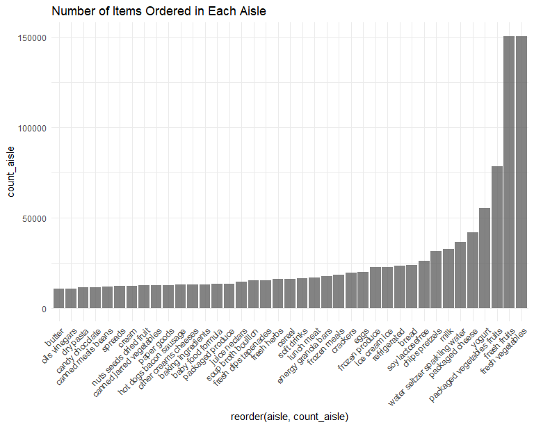

p8105_hw3_td2809
================
Chris Deng
2023-10-14

# Problem 1

``` r
data("instacart") # import dataset

instacart = 
  instacart |> 
  as_tibble()
```

The data set `instacart` contains 1384617 observations and 15 variables
related to the information of 131209 orders of 131209 users.

- How many aisles are there, and which aisles are the most items ordered
  from?

``` r
aisles_number = 
  instacart |> 
  group_by(aisle) |> 
  summarize(count_aisle = n()) |> 
  mutate(rank_aisle = min_rank(desc(count_aisle))) |> 
  arrange(rank_aisle)
```

There are 134 aisles and fresh vegetables is the aisle with the most
items ordered from.

- Make a plot that shows the number of items ordered in each aisle,
  limiting this to aisles with more than 10000 items ordered. Arrange
  aisles sensibly, and organize your plot so others can read it.

``` r
instacart |> 
  group_by(aisle)|>
  summarize(count_aisle = n())|>
  arrange(count_aisle)|>
  filter(count_aisle > 10000) |> 
  ggplot(aes(x = reorder(aisle, count_aisle), y = count_aisle)) +
  geom_bar(stat = "identity", alpha = .75) + 
  labs(title = "Number of Items Ordered in Each Aisle") +
  theme(
    axis.text.x = element_text(angle = 45, hjust = 1) 
    )
```



- Make a table showing the three most popular items in each of the
  aisles “baking ingredients”, “dog food care”, and “packaged vegetables
  fruits”. Include the number of times each item is ordered in your
  table.

``` r
instacart |> 
  filter(aisle %in% c("baking ingredients", "dog food care", "packaged vegetables fruits")) |> 
  count(aisle, product_name, sort = T) |> 
  group_by(aisle) |> 
  top_n(3, n) |> # top 3 products within each group
  knitr::kable()
```

| aisle                      | product_name                                  |    n |
|:---------------------------|:----------------------------------------------|-----:|
| packaged vegetables fruits | Organic Baby Spinach                          | 9784 |
| packaged vegetables fruits | Organic Raspberries                           | 5546 |
| packaged vegetables fruits | Organic Blueberries                           | 4966 |
| baking ingredients         | Light Brown Sugar                             |  499 |
| baking ingredients         | Pure Baking Soda                              |  387 |
| baking ingredients         | Cane Sugar                                    |  336 |
| dog food care              | Snack Sticks Chicken & Rice Recipe Dog Treats |   30 |
| dog food care              | Organix Chicken & Brown Rice Recipe           |   28 |
| dog food care              | Small Dog Biscuits                            |   26 |

- Make a table showing the mean hour of the day at which Pink Lady
  Apples and Coffee Ice Cream are ordered on each day of the week;
  format this table for human readers (i.e. produce a 2 x 7 table).

``` r
instacart |> 
  filter(product_name %in% c("Pink Lady Apples", "Coffee Ice Cream")) |> 
  group_by(product_name,order_dow) |> 
  summarise(mean_hour = mean(order_hour_of_day)) |> 
  pivot_wider(
    names_from = order_dow,
    values_from = mean_hour
  ) |> 
  knitr::kable(digits = 2)
```

    ## `summarise()` has grouped output by 'product_name'. You can override using the
    ## `.groups` argument.

| product_name     |     0 |     1 |     2 |     3 |     4 |     5 |     6 |
|:-----------------|------:|------:|------:|------:|------:|------:|------:|
| Coffee Ice Cream | 13.77 | 14.32 | 15.38 | 15.32 | 15.22 | 12.26 | 13.83 |
| Pink Lady Apples | 13.44 | 11.36 | 11.70 | 14.25 | 11.55 | 12.78 | 11.94 |
